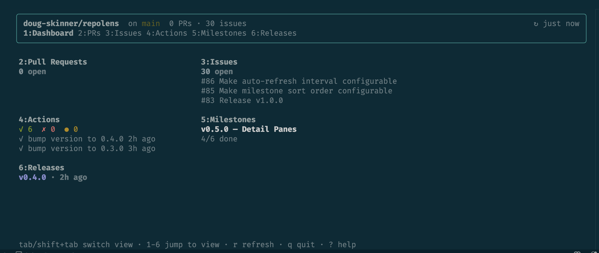
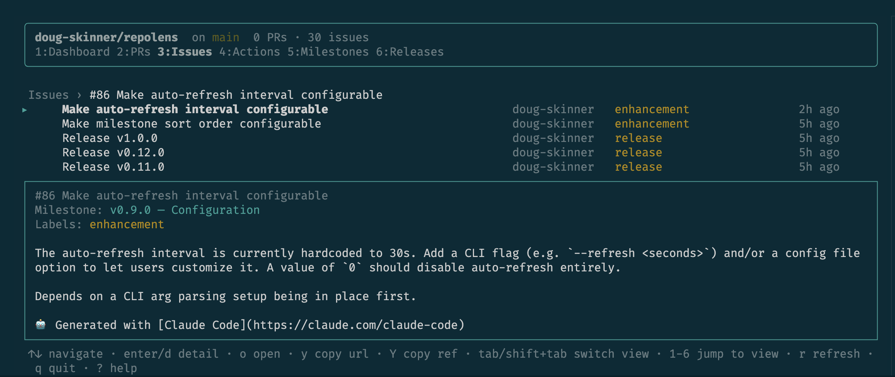
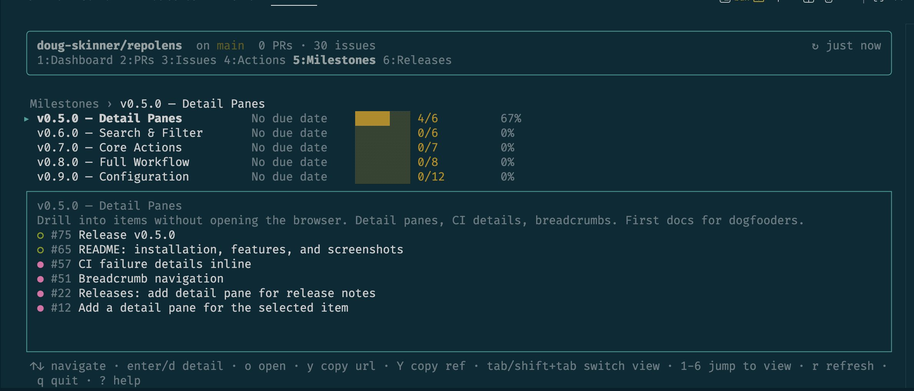

# repolens

A focused TUI dashboard for your GitHub repository. See pull requests, issues, actions, milestones, and releases at a glance — without leaving the terminal.



## Features

- **Dashboard overview** — PR, issue, actions, milestone, and release summaries in a single view
- **Dedicated list views** — drill into PRs, issues, Actions runs, milestones, or releases
- **Detail panes** — expand any item inline to see full context
- **Keyboard-driven** — vim-style navigation (`j`/`k`, `gg`/`G`), tab between views, number keys to jump
- **Auto-refresh** — data refreshes automatically in the background
- **Review requests** — see how many reviews are waiting for you
- **Open in browser** — press `o` to jump straight to the item on GitHub
- **Copy URLs** — `y` copies the item URL, `Y` copies the branch ref

### More screenshots





## Installation

### Homebrew

```sh
brew install doug-skinner/repolens/repolens
```

### Build from source

Requires [Bun](https://bun.sh) v1.1+.

```sh
git clone https://github.com/doug-skinner/repolens.git
cd repolens
bun install
bun run build
```

This produces a standalone `repolens` binary. Move it somewhere on your `PATH`:

```sh
sudo cp repolens /usr/local/bin/
```

## Requirements

- [GitHub CLI](https://cli.github.com) (`gh`) installed and authenticated — run `gh auth login` if you haven't already

## Usage

Run `repolens` from any directory inside a Git repository with a GitHub remote:

```sh
repolens
```

## Keybindings

### Global

| Key         | Action             |
| ----------- | ------------------ |
| `?`         | Toggle help screen |
| `q`         | Quit               |
| `r`         | Refresh all data   |
| `Tab`       | Next view          |
| `Shift+Tab` | Previous view      |
| `1`–`6`     | Jump to view       |

### List views

| Key                | Action                |
| ------------------ | --------------------- |
| `↑`/`↓` or `j`/`k` | Navigate items        |
| `gg` / `G`         | Jump to top / bottom  |
| `Enter` / `d`      | Toggle detail pane    |
| `o`                | Open in browser       |
| `y`                | Copy URL to clipboard |
| `Y`                | Copy branch/tag ref   |

## License

[MIT](LICENSE)
